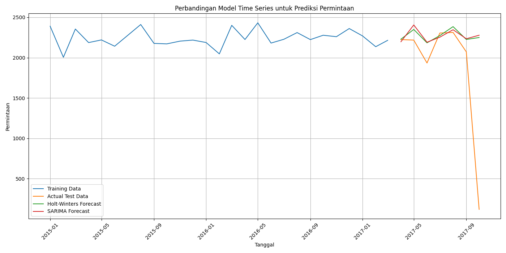
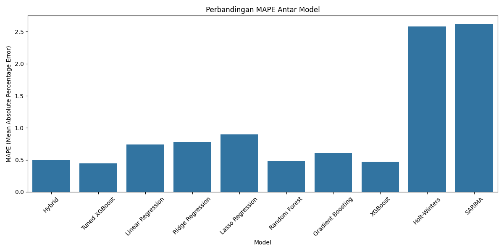
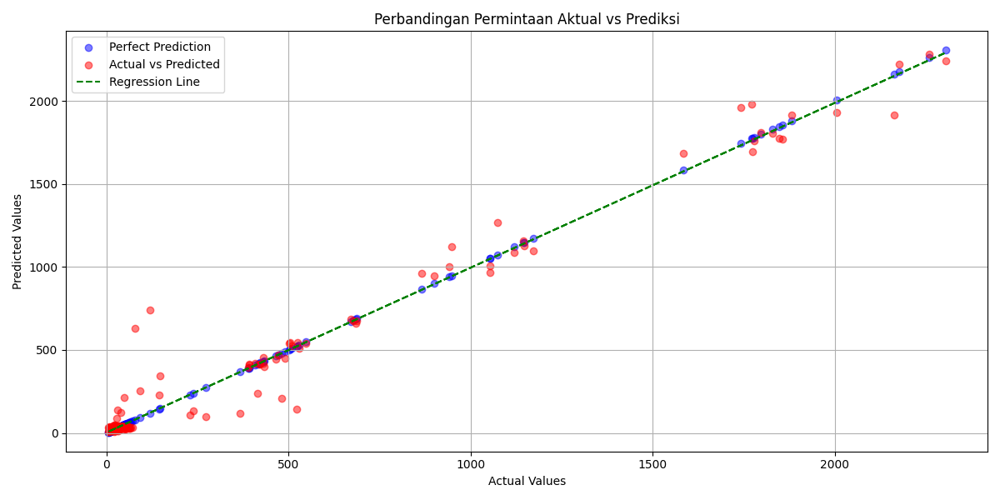
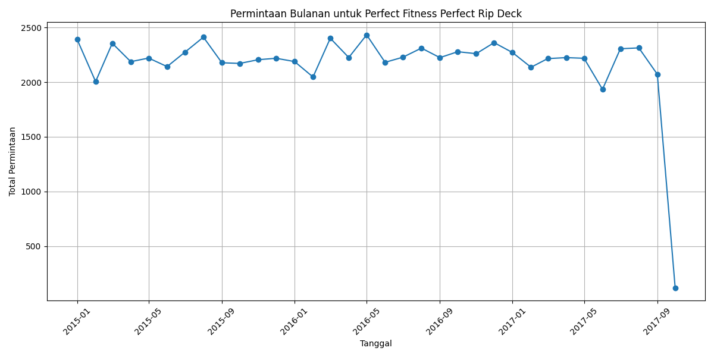

<div align="center">

# 📦 Demand Forecasting & Supply Chain Intelligence

### Machine Learning and Time Series Analytics for Demand Prediction and Supply Chain Optimization

🏆 **Finalist — Big Data Analytics Competition (FESMARO), Universitas Negeri Malang 2025**


### 🟡 Competition Project (Data Challenge / Hackathon)

📍 Big Data Analytics Competition (FESMARO), Universitas Negeri Malang 2025

</div>

---

# 🖥️ Project Visualization



> An end-to-end forecasting and supply chain analytics project designed to predict product demand, detect structural disruptions, and generate strategic recommendations for inventory and distribution planning.

---

# 🧠 Project Overview

This project develops a data-driven demand forecasting system to predict monthly product demand and analyze the operational impact of product discontinuation within a supply chain environment.

The solution combines statistical forecasting, machine learning, feature engineering, and model interpretation to uncover key drivers of demand behavior and support proactive supply chain decision-making.

The project was developed as part of a team that reached the **Finalist** stage in the **Big Data Analytics Competition (FESMARO) 2025**. The original project materials are documented in the repository provided by the team. :contentReference[oaicite:0]{index=0}

---

# 🎯 Project Objectives

- Predict monthly demand with high accuracy.
- Detect structural changes in demand patterns.
- Compare time series and machine learning models.
- Identify the most influential business features.
- Generate actionable supply chain recommendations.

---

# 🗂️ Dataset Overview

| Attribute | Value |
|---------|-------|
| Dataset | DataCo Smart Supply Chain |
| Domain | Supply Chain Analytics |
| Forecast Target | Monthly Product Demand |
| Key Features | Product ID, Discount, Late Delivery Risk |
| Performance Metric | Mean Absolute Percentage Error (MAPE) |

---

# 🧪 Methodology

```text
Data Exploration
        ↓
Data Cleaning & Aggregation
        ↓
Feature Engineering
        ↓
Time Series Modeling (SARIMA, Holt-Winters)
        ↓
Machine Learning Modeling
        ↓
Hyperparameter Tuning
        ↓
Model Evaluation (MAPE)
        ↓
Feature Importance Analysis
        ↓
Strategic Recommendation
```

---

# 📈 Model Performance

| Model | MAPE |
|------|-----:|
| Tuned XGBoost | **0.45** |
| Random Forest | 0.48 |
| XGBoost | 0.47 |
| Gradient Boosting | 0.62 |
| Linear Models | 0.75 – 0.89 |
| Holt-Winters | 2.59 |
| SARIMA | 2.62 |

> 🏆 **Best Model:** Tuned XGBoost

---

# ✨ Key Features

- 📈 Monthly demand forecasting
- 🔍 Structural break detection
- 🤖 Machine learning model comparison
- 📊 Feature importance analysis
- 📦 Inventory risk insights
- 🧠 Strategic supply chain recommendations

---

# 🖼️ Additional Insights

## 📈 Model Performance Comparison


## 🎯 Actual vs Predicted


## 📦 Top Product Demand Contribution


## 📉 Time Series Analysis


---

# 🔍 Key Findings

- Tuned XGBoost achieved the lowest forecasting error.
- Demand patterns were highly non-linear and event-driven.
- Product discontinuation caused a demand decline of more than 80%.
- Traditional time series models struggled to capture structural disruption.
- Product dependency, discount strategy, and delivery risk were the primary demand drivers.

---

# 👥 Team & Contributions

| Name | Role |
|------|------|
| **Muhammad Wildan Nabila** | Data Scientist / Machine Learning Engineer |
| Anindya Samantha Prayoga | Data Scientist |
| Muhammad Firdig Haqqy Abdillah | Data Analyst |

---

# 👨‍💻 My Contribution

My primary responsibilities in this project included:

- Data exploration and preprocessing.
- Feature engineering based on business logic.
- Machine learning model development and evaluation.
- Model comparison and performance interpretation.
- Strategic insight generation and documentation.

---

# 🚧 Key Challenge

**Challenge:** Forecasting demand under extreme structural changes caused by product discontinuation.

**Solution:** We engineered business-driven features and applied tuned XGBoost to capture non-linear relationships and abrupt shifts in demand patterns.

---

# 💼 Business Impact

This solution can help organizations to:

- Improve forecasting accuracy.
- Reduce overstock and stockout risk.
- Detect early warning signals of demand collapse.
- Optimize inventory and distribution planning.
- Support proactive supply chain decision-making.

---

# 🔗 Official Repository

https://github.com/anindyaprayoga/dataco-supply-chain-1

---

# 🛠️ Technology Stack

- Python
- Pandas
- NumPy
- Scikit-learn
- XGBoost
- Statsmodels
- Matplotlib

---

# 🎯 Career Relevance

Relevant for roles in:

- Data Analyst
- Data Scientist
- Machine Learning Engineer
- Supply Chain Analyst
- Operations Analyst
- Business Intelligence Analyst

---

# 👨‍💻 Author

**Muhammad Wildan Nabila**  
Data Scientist / Machine Learning Engineer — Competition Team

---

<div align="center">

### 📦 Transforming Historical Demand Data into Strategic Supply Chain Intelligence

</div>
