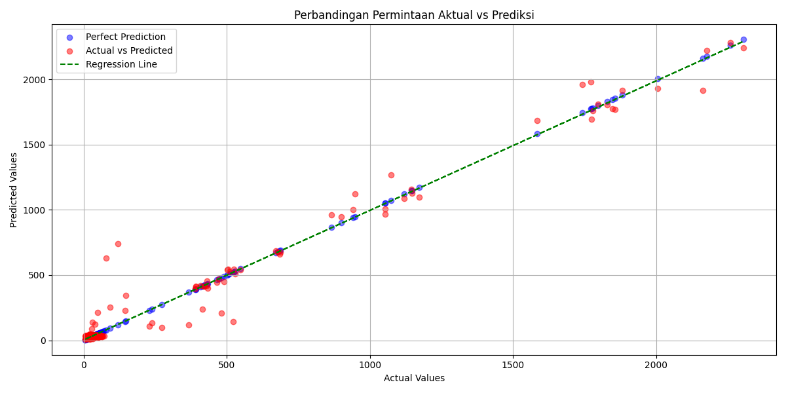
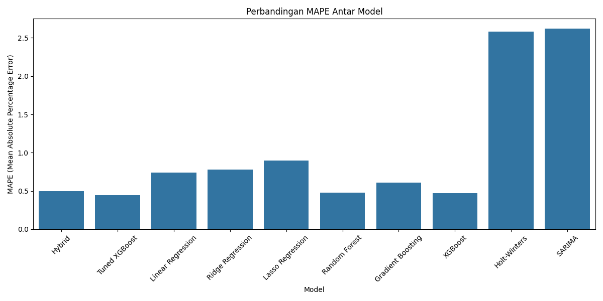
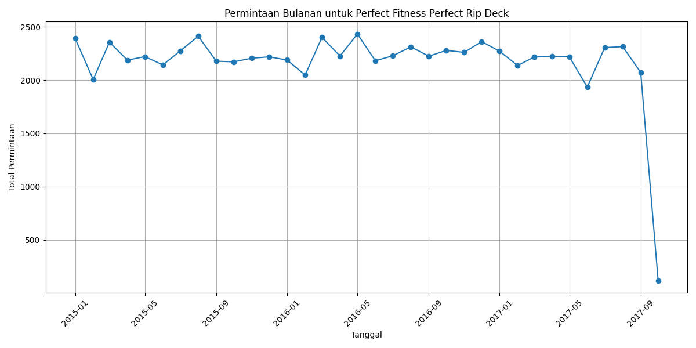
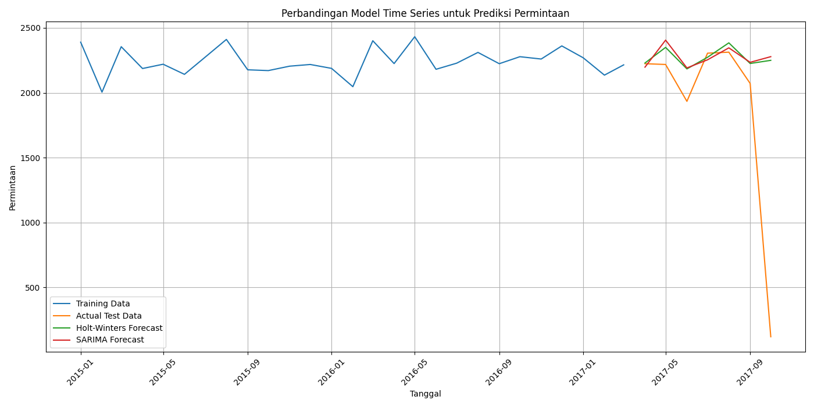

<div align="center">

# Demand Forecasting & Supply Chain Intelligence

**Machine Learning · Time Series Forecasting · Supply Chain Analytics**

<br>


<br>


<br><br>

> **Predicting monthly product demand and translating forecasting signals into actionable supply-chain intelligence.**

<br>

[](https://github.com/anindyaprayoga/dataco-supply-chain-1)

</div>

---

## Project at a Glance

<table>
<tr>
<td align="center" width="25%">
<strong>Forecasting</strong><br>
Monthly Demand
</td>
<td align="center" width="25%">
<strong>Best Model</strong><br>
Tuned XGBoost
</td>
<td align="center" width="25%">
<strong>Evaluation</strong><br>
MAPE
</td>
<td align="center" width="25%">
<strong>Achievement</strong><br>
FESMARO Finalist
</td>
</tr>
</table>

---

## Why This Project Matters

Supply-chain forecasting becomes considerably more difficult when historical demand is disrupted by nonlinear behavior, operational factors, or product discontinuation.

This project combines **statistical time-series forecasting and machine learning** to investigate which modeling strategy is better able to represent these changing demand patterns.

> **Core question:** How can historical supply-chain data be transformed into reliable demand forecasts when the underlying demand structure changes?

---

## Analytical Pipeline

```text
                         SUPPLY CHAIN DATA
                                │
                                ▼
                     Cleaning & Aggregation
                                │
                                ▼
                       Feature Engineering
                                │
                  ┌─────────────┴─────────────┐
                  ▼                           ▼
          TIME-SERIES MODELS            MACHINE LEARNING
          SARIMA                        Random Forest
          Holt-Winters                  Gradient Boosting
                                       XGBoost
                  │                           │
                  └─────────────┬─────────────┘
                                ▼
                       Model Benchmarking
                              MAPE
                                │
                                ▼
                       Tuned XGBoost
                                │
                                ▼
                   Supply Chain Intelligence
```

---

## Model Benchmark

| Model | MAPE | Relative Performance |
|:---|---:|:---|
| **Tuned XGBoost** | **0.45** | **Best observed** |
| XGBoost | 0.47 | Strong |
| Random Forest | 0.48 | Strong |
| Gradient Boosting | 0.62 | Moderate |
| Linear Models | 0.75–0.89 | Baseline |
| Holt-Winters | 2.59 | Higher error |
| SARIMA | 2.62 | Higher error |

> **Result:** Tuned XGBoost produced the lowest forecasting error among the evaluated approaches.

> **Metric validation:** If these values were generated using `sklearn.metrics.mean_absolute_percentage_error`, `0.45` corresponds to approximately **45% MAPE**. Verify the implementation before presenting the value as a percentage.

---

## Visual Analytics

### Actual vs. Predicted Demand

<p align="center">
  
</p>

The comparison shows how closely model predictions follow observed monthly demand and where forecasting errors become more pronounced.

### Model Performance

<p align="center">
  
</p>

The experiment indicates that the evaluated machine-learning models achieved lower forecasting errors than the classical time-series approaches under the analyzed conditions.

### Product Demand Contribution

<p align="center">
  
</p>

Product-level analysis highlights demand concentration and provides additional context for inventory prioritization and product-level planning.

### Temporal Demand Behavior

<p align="center">
  
</p>

The temporal analysis reveals substantial changes in historical demand behavior, including periods where previous demand patterns become less representative of subsequent observations.

---

## Key Insights

<table>
<tr>
<td width="50%" valign="top">

### 01 · Predictive Performance

**Tuned XGBoost achieved the lowest observed forecasting error** among the evaluated models.

The result indicates that nonlinear relationships and engineered operational features provided useful predictive information.

</td>
<td width="50%" valign="top">

### 02 · Structural Disruption

Demand declined by **more than 80%** around the investigated product-discontinuation event.

This represents a substantial departure from preceding historical behavior.

</td>
</tr>

<tr>
<td width="50%" valign="top">

### 03 · Time-Series Limitation

SARIMA and Holt-Winters produced substantially higher errors in this experiment.

Historical temporal structure alone was insufficient to represent the observed disruption effectively.

</td>
<td width="50%" valign="top">

### 04 · Operational Signals

Product characteristics, discount information, delivery risk, and historical demand provided additional analytical context for modeling demand variation.

</td>
</tr>
</table>

---

## From Prediction to Decision Support

```text
FORECAST SIGNAL
      │
      ├── Demand ↑ ───────► Inventory Readiness
      │
      ├── Demand ↓ ───────► Overstock Risk Review
      │
      └── Structural Shift ► Forecast Assumption Review
                                  │
                                  ▼
                         OPERATIONAL DECISION
```

| Analytical Signal | Potential Decision Use |
|---|---|
| Demand increase | Inventory and capacity preparation |
| Demand decline | Excess-stock risk assessment |
| Structural shift | Forecast-model reassessment |
| Product concentration | Product-level prioritization |
| Delivery-risk signal | Fulfillment and distribution review |

> These are **potential decision-support applications**, not measured post-deployment business outcomes.

---

## Technical Challenge

**Challenge**

Forecasting demand under extreme structural change caused by product discontinuation.

**Approach**

Business-oriented feature engineering was combined with comparative modeling and tuned gradient boosting to capture nonlinear relationships and abrupt changes that were difficult for conventional time-series models to represent.

---

## My Contribution

**Muhammad Wildan Nabila — Data Scientist / Machine Learning Engineer**

- Exploratory data analysis and preprocessing
- Business-oriented feature engineering
- Machine learning model development
- Model evaluation and benchmarking
- Forecast-performance interpretation
- Structural demand analysis
- Supply-chain insight generation
- Technical documentation and competition deliverables

---

## Team

| Member | Role |
|---|---|
| **Muhammad Wildan Nabila** | **Data Scientist / Machine Learning Engineer** |
| Anindya Samantha Prayoga | Data Scientist |
| Muhammad Firdig Haqqy Abdillah | Data Analyst |

Developed collaboratively for the **Big Data Analytics Competition (FESMARO), Universitas Negeri Malang 2025**, where the team reached the **Finalist** stage.

---

## Technology Ecosystem

<div align="center">


&nbsp;&nbsp;

&nbsp;&nbsp;

&nbsp;&nbsp;

&nbsp;&nbsp;

&nbsp;&nbsp;


<br><br>

`Python` · `NumPy` · `Pandas` · `Scikit-learn` · `XGBoost` · `Statsmodels` · `Matplotlib` · `Jupyter`

</div>

---

## Repository Structure

```text
demand-forecasting-supply-chain/
│
├── assets/
│   ├── model_comparison.png
│   ├── prediction_comparison.png
│   ├── time_series_comparison.png
│   └── top_product_demand.png
│
├── data/
├── notebooks/
├── src/
├── results/
│
├── requirements.txt
├── LICENSE
└── README.md
```

---

## Project Provenance

This repository documents **Muhammad Wildan Nabila's contribution and portfolio representation** of the collaborative competition project.

<div align="center">

[](https://github.com/anindyaprayoga/dataco-supply-chain-1)

</div>

---

## Project Summary

| | |
|---|---|
| **Problem** | Demand forecasting under structural disruption |
| **Approach** | Time Series + Machine Learning |
| **Best Model** | Tuned XGBoost |
| **Analytical Value** | Demand forecasting and structural-change analysis |
| **Decision Context** | Inventory, distribution, and demand-risk assessment |
| **Achievement** | **FESMARO 2025 Finalist** |

---

<div align="center">

### Historical Data → Predictive Modeling → Supply Chain Intelligence

**Muhammad Wildan Nabila**

Data Science · Machine Learning · Data Analytics

</div>
